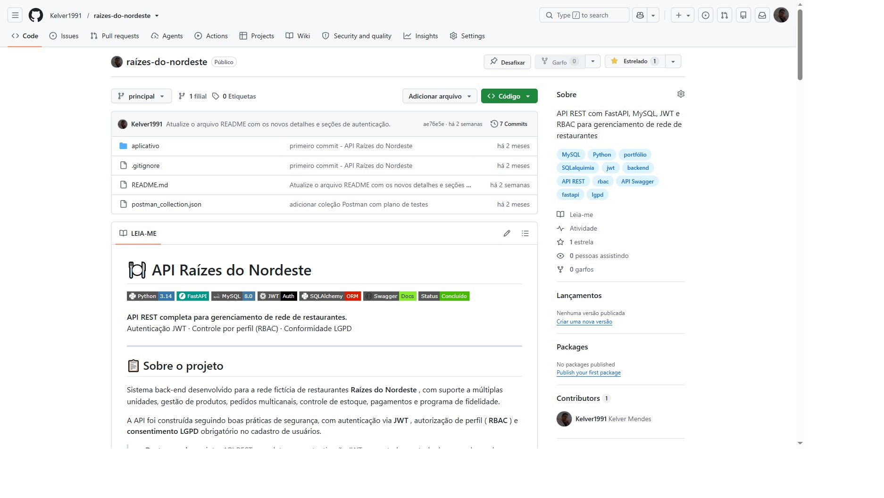

# 🍽️ Raízes do Nordeste API

[](https://python.org)
[](https://fastapi.tiangolo.com)
[](https://mysql.com)
[](https://jwt.io)
[](https://sqlalchemy.org)
[](http://localhost:8000/docs)
[](https://github.com/Kelver1991/raizes-do-nordeste)

**API REST completa para gestão de rede de restaurantes.**  
Autenticação JWT · Controle por perfil (RBAC) · Conformidade LGPD

---

## 📋 Sobre o projeto

Sistema back-end desenvolvido para a rede fictícia de restaurantes **Raízes do Nordeste**, com suporte a múltiplas unidades, gestão de produtos, pedidos multi-canal, controle de estoque, pagamentos e programa de fidelidade.

A API foi construída seguindo boas práticas de segurança, com autenticação via **JWT**, autorização por perfil (**RBAC**) e **consentimento LGPD** obrigatório no cadastro de usuários.

> 🇺🇸 **Project highlights:** Full REST API with stateless JWT authentication, role-based access control (RBAC) with 5 user profiles, LGPD (Brazilian GDPR) compliance, multi-channel order management, and Swagger/OpenAPI 3.1 documentation.

---

## 🖥️ Preview

A API conta com documentação interativa gerada automaticamente pelo **Swagger UI / OpenAPI 3.1**.  
Após rodar o projeto localmente, acesse `http://localhost:8000/docs` para explorar e testar todos os endpoints.



---

## 🚀 Tecnologias

| Categoria      | Tecnologia                           |
| -------------- | ------------------------------------ |
| Linguagem      | Python 3.14                          |
| Framework      | FastAPI                              |
| Banco de Dados | MySQL 8.0                            |
| ORM            | SQLAlchemy                           |
| Autenticação   | JWT (python-jose) + bcrypt (Passlib) |
| Validação      | Pydantic                             |
| Servidor       | Uvicorn (ASGI)                       |
| Documentação   | Swagger / OpenAPI 3.1                |
| Testes         | Postman                              |
| Versionamento  | Git / GitHub                         |

---

## 🔐 Autenticação & Autorização

O sistema utiliza autenticação stateless com **JWT** (expiração de 60 minutos) e controle de acesso baseado em perfis **(RBAC)**:

| Perfil      | Descrição                                 |
| ----------- | ----------------------------------------- |
| `ADMIN`     | Acesso total ao sistema                   |
| `GERENTE`   | Gestão de unidades, produtos e relatórios |
| `COZINHA`   | Visualização e atualização de pedidos     |
| `ATENDENTE` | Criação de pedidos e atendimento          |
| `CLIENTE`   | Pedidos, pagamentos e fidelidade          |

> ⚠️ O consentimento LGPD é obrigatório no cadastro de usuários.

---

## 📡 Endpoints

### 🔑 Autenticação

| Método | Rota              | Descrição                | Auth |
| ------ | ----------------- | ------------------------ | ---- |
| `POST` | `/auth/registrar` | Cadastro de usuário      | ❌    |
| `POST` | `/auth/login`     | Login e geração de token | ❌    |
| `GET`  | `/auth/perfil`    | Dados do usuário logado  | ✅    |

### 🏪 Unidades

| Método | Rota             | Descrição         | Auth |
| ------ | ---------------- | ----------------- | ---- |
| `GET`  | `/unidades/`     | Listar unidades   | ❌    |
| `POST` | `/unidades/`     | Criar unidade     | ✅    |
| `GET`  | `/unidades/{id}` | Buscar unidade    | ❌    |
| `PUT`  | `/unidades/{id}` | Atualizar unidade | ✅    |

### 🍽️ Produtos

| Método   | Rota             | Descrição         | Auth |
| -------- | ---------------- | ----------------- | ---- |
| `POST`   | `/produtos/`     | Criar produto     | ✅    |
| `GET`    | `/produtos/`     | Listar produtos   | ❌    |
| `GET`    | `/produtos/{id}` | Buscar produto    | ❌    |
| `PUT`    | `/produtos/{id}` | Atualizar produto | ✅    |
| `DELETE` | `/produtos/{id}` | Deletar produto   | ✅    |

### 📦 Estoque

| Método | Rota                            | Descrição                     | Auth |
| ------ | ------------------------------- | ----------------------------- | ---- |
| `POST` | `/estoque/entrada`              | Entrada de estoque            | ✅    |
| `POST` | `/estoque/saida`                | Saída de estoque              | ✅    |
| `GET`  | `/estoque/unidade/{unidade_id}` | Consultar estoque por unidade | ❌    |

### 📋 Pedidos

| Método  | Rota                     | Descrição        | Auth |
| ------- | ------------------------ | ---------------- | ---- |
| `POST`  | `/pedidos/`              | Criar pedido     | ✅    |
| `GET`   | `/pedidos/`              | Listar pedidos   | ✅    |
| `GET`   | `/pedidos/{id}`          | Buscar pedido    | ✅    |
| `PATCH` | `/pedidos/{id}/status`   | Atualizar status | ✅    |
| `PATCH` | `/pedidos/{id}/cancelar` | Cancelar pedido  | ✅    |

> Canais suportados: `APP` · `TOTEM` · `BALCÃO` · `PICKUP` · `WEB`

### 💳 Pagamentos

| Método | Rota                      | Descrição           | Auth |
| ------ | ------------------------- | ------------------- | ---- |
| `POST` | `/pagamentos/processar`   | Processar pagamento | ✅    |
| `GET`  | `/pagamentos/{pedido_id}` | Consultar pagamento | ✅    |

### ⭐ Fidelidade

| Método | Rota                      | Descrição                 | Auth |
| ------ | ------------------------- | ------------------------- | ---- |
| `GET`  | `/fidelidade/saldo`       | Consultar saldo de pontos | ✅    |
| `POST` | `/fidelidade/resgatar`    | Resgatar pontos           | ✅    |
| `GET`  | `/fidelidade/admin/todos` | Listar todos (admin)      | ✅    |

---

## ⚙️ Como executar localmente

### Pré-requisitos

- Python 3.14+
- MySQL 8.0+
- Git

### 1. Clone o repositório

```bash
git clone https://github.com/Kelver1991/raizes-do-nordeste.git
cd raizes-do-nordeste
```

### 2. Crie e ative o ambiente virtual

```bash
python -m venv venv

# Windows
venv\Scripts\activate

# Linux/Mac
source venv/bin/activate
```

### 3. Instale as dependências

```bash
pip install -r requirements.txt
```

### 4. Configure as variáveis de ambiente

Copie o arquivo de exemplo e preencha com seus dados:

```bash
cp .env.example .env
```

Conteúdo do `.env`:

```env
DB_HOST=localhost
DB_PORT=3306
DB_USER=usuario
DB_PASSWORD=senha
DB_NAME=raizes_db
SECRET_KEY=sua_chave_secreta
ALGORITHM=HS256
ACCESS_TOKEN_EXPIRE_MINUTES=60
```

### 5. Execute o servidor

```bash
uvicorn app.main:app --reload
```

### 6. Acesse a documentação interativa
